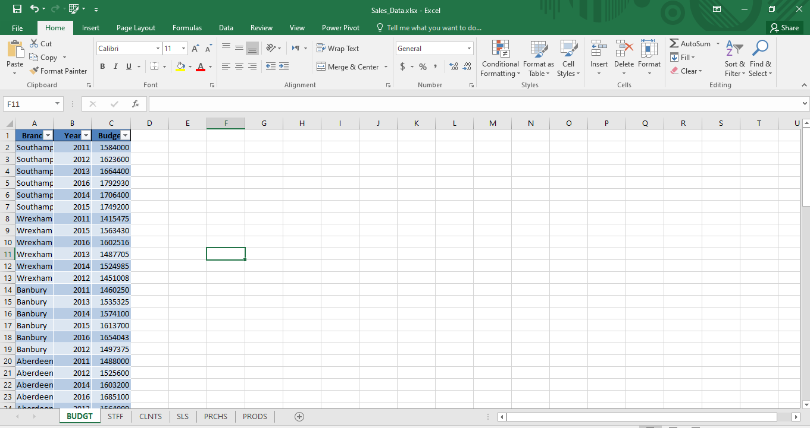
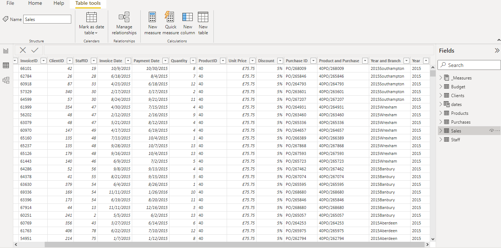
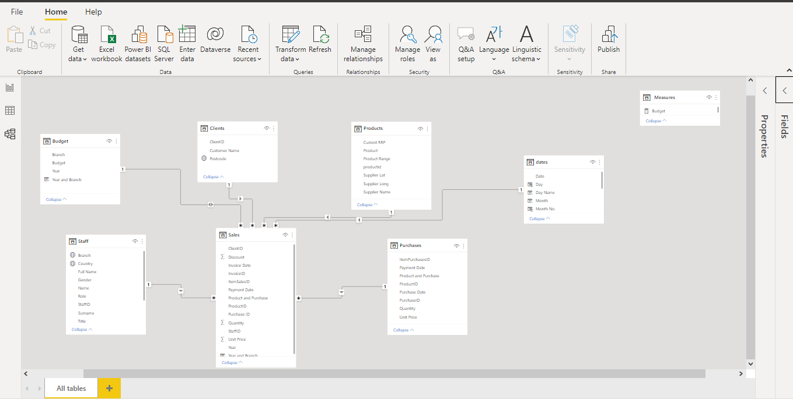
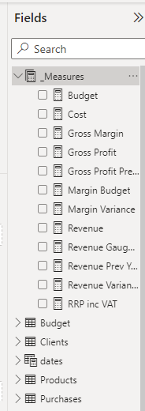
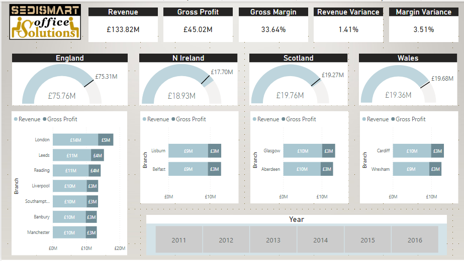
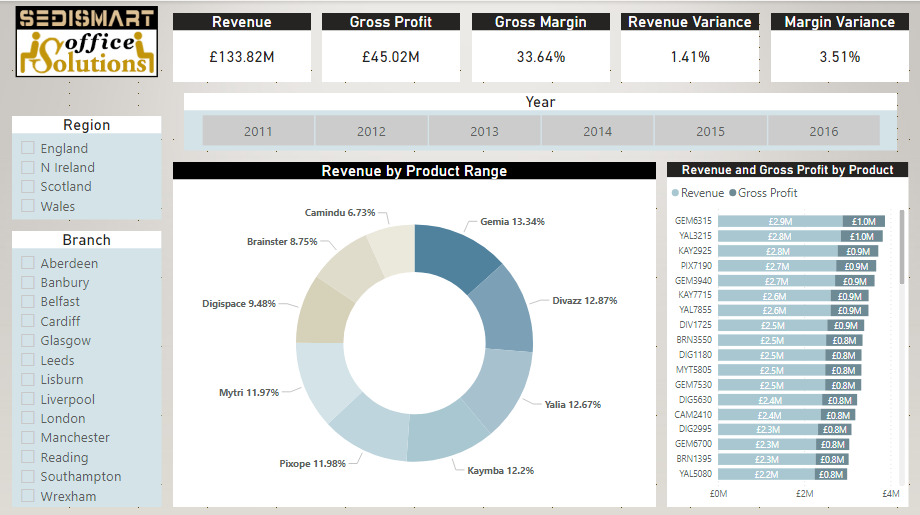
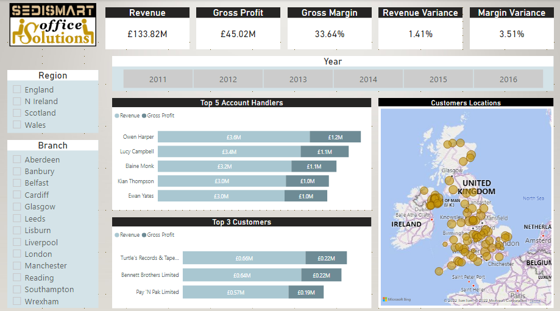
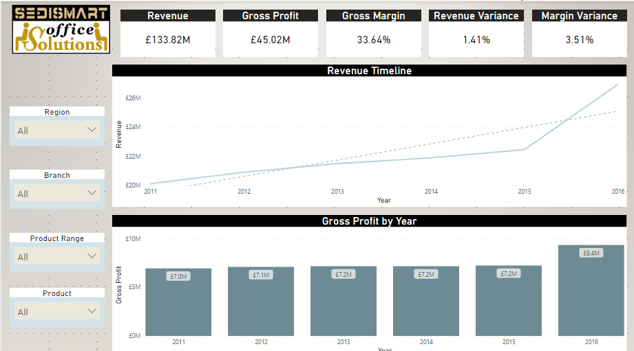

## Introduction
**Scenario:**\
SEDISMART is an imaginary office furniture &equipment company and the management has a meeting soon in which they discuss the business-status.The tasks were to provide a revenue analysis by multiple criteria using different business metrics. Furthermore, I received a business
a revenue breakdown by different crteria and to show that in an interactive self-service dashboard. 

**Data Scource:**\
Excel file containing the budget, staff, clients, sales, purchases and products tables. 

## Project Plan and Flow Summary

__Data Collection__\
- Connected to the Excel files usng Power Bi and extracted the relavent tables.\

__Data Preparation__\
- Cleaned and munged the data extracted in  the query editor. 
- Added a composite keys to the sales and the purchases tables and to the sales and budget tables using DAX to be able to connect them in the data model.
- Consturcted a dynamic calendar table from the first and last date in the sales table using DAX.\

__Data Modeling__\
- Connected the tables in the data model.\

__Data Analysis__\
Calculated the business metrics using DAX ad visualized the findings ofthe analysis using various visuals.

__Findings Presentations__\
Designed a report with a 4 self-service interactive dashboards; revenue by regions and cities, revenue by products, revenue by account handlers and customers, revenue timeline and trend.

