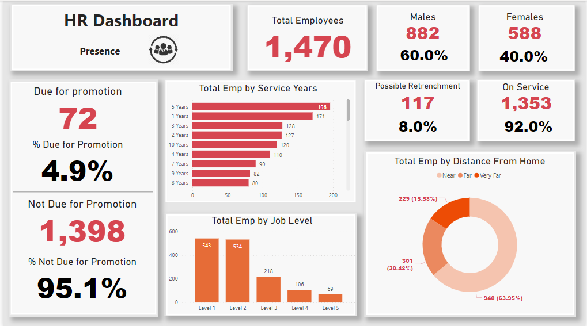
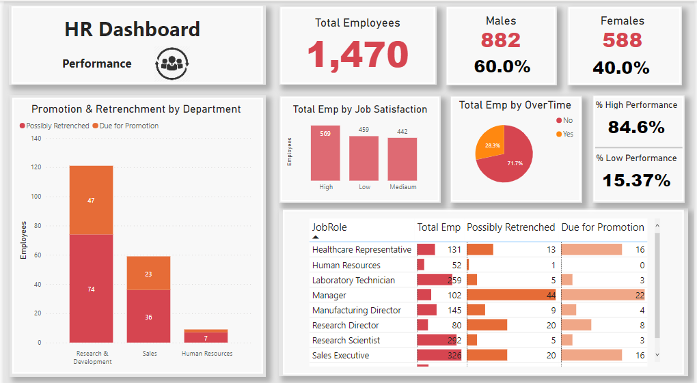

# HR Data Analytics

## Summary:

In this project, I analyzed an HR dataset that I found online in a csv form. I uploaded the data into Power BI and produced 2 dashboards using HR metrics.

## Presence Dashboard
This dashboard included:
- Total Employees and Perentage by Gender.
- Total Employees and Percentage by Promotion Due nad Possible Retrenchment.
- Total Employees by Service Years.
- Total Employees by Job Level.
- Total Employees by Distance from Home.

# Performance and Satisfaction Dashboard
In this dashboard, I provide more detailed information about:
- Promotion and Retrenchment by Department.
- Total Employees by Job Satisfaction.
- Total Employees by Over Time.
- Percentage of Employees by Performance.

