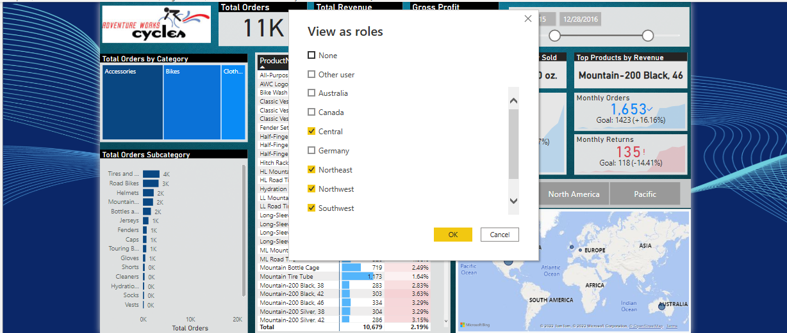

# AdvenuteWorks Data Analytics

## Intro & Scenario:
AdventureWorks Database is a Microsoft product sample for an online transaction processing (OLTP) database with a transformed and 
aggregated (OLAP) version. In this project, I used modified csv files from the (OLAP) version which are filtered to certain
geographical regions. The scenario is that the marketing and sales teams are holding a meeting soon, in which they will discuss 
the perofrmance of their products and customers.

## Data Source:
1. 6 csv files of Customers, Porudcts, Products Categories, Products Subcateories, Returns and Territories.
2. A folder with 3 csv files for the sales records of 2015, 2016 and 2017.

## Objectives
- To provide an executive summary of the performance of the products (managerial level).
- To show the performance of each individual products (executive level).
- To show the performance of each idividual customers (executive level).

## Project Pland and Flow Summary:
__Data Preparation__
- Collected data fromcsv files and folder.
- Cleaned and trasformed the data .\

\
_Data Modeling__
- Connected multiple tables in the data model.\

\
__Data Analysis__
- Caculated the business metrics usign DAX.\

\
__Data Visualization and Findings Presentation__
In this project, I designed a report with 3 self-service interactive dashboards; Executive Summary, Product Details and Customer Details.\

\
The desgin the Executive Summary dashboard included:
- Measures of the Total Orders, Total Revenue and Total Gross Profit in summary cards.
- Top product by Total Qunatity Sold and top product by Total Revenue in summary cards using visual level filter.
- Break down of the Total Orders by Product Category, Product Subcategory and Region in tree chart, bar chart and map
visual respectively.
- Viulaiziation of the monthly Total Revenue of the current start of month in comparision with the previous month in a KPI visual.
- Viulaiziation of the monthly Totoal Orders of the current start of month in comparision with the previous month in a KPI visual.
- Viulaiziation of the monthyl Total Returns of the current start of month in comparision with the previous month in a KPI visual.
- Viulaiziation of the Product Name, Total Orders and Returns Rate in pivot table with conditional formating to show the products
with larger Total Orders and Returns Rate. A user can drill down to any product from this visual to the Product Details dasborad.
- Add a slicer to filer by date.

\

The desgin the Product Details dashboard included:
- A slice for the parameter of Price Adjustment (%) which can be used to adjust the Adjusted Total Revenue.
- Visualization of the Total Revenue in comparision Adjusted Total Revenue in a line chart.
- Break down of the Return by Product Category in an stacked area chart.
- Visualization of the Current Monthly Orders vs Target Monthly Orders in a gauge visual.
- Visualization fo the Current Monthyl Revenue vs. Target Monthyl Revenue in a guage visual.
- Visualization of the Current Monthly Returns vs the Target Monthly Return in a guage visual.

\

The design of the Customer Details incldued:
- A visualization of the Total Orders and Total Revenue by customer in a pivot table.
- A break down of the Total Orders and Total Revenue by Gender, Income Level and Education Level in 3 donut charts.
- Visualization of the Total Revenue and Total orders timelines in a line and clustered column chart which can be filtered by individual selection fo customers
from the pivot table.
- The name of the top customers based on Total Revenue and both the Total Orders and the Total Revenue associated with this customer in 3 summary cards. This 
visual can be filtered by the donut chat values or the pivot table.

\

Finally, I setuped separate roles for each region to provide AdevntureWorks' sales managers from different regions with reports that only contain the data that 
is relevant to them.
