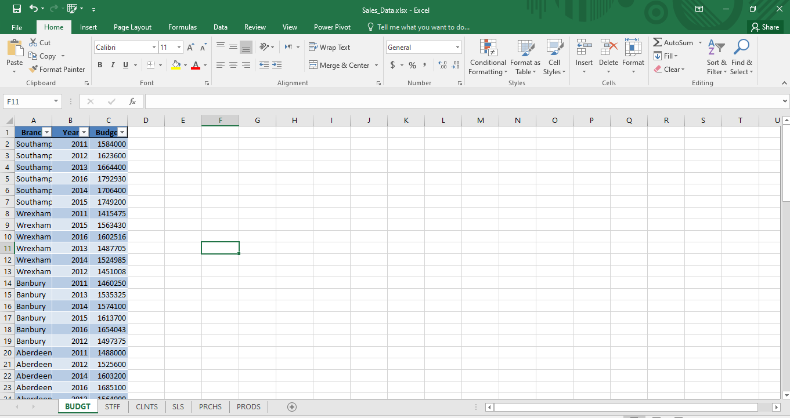
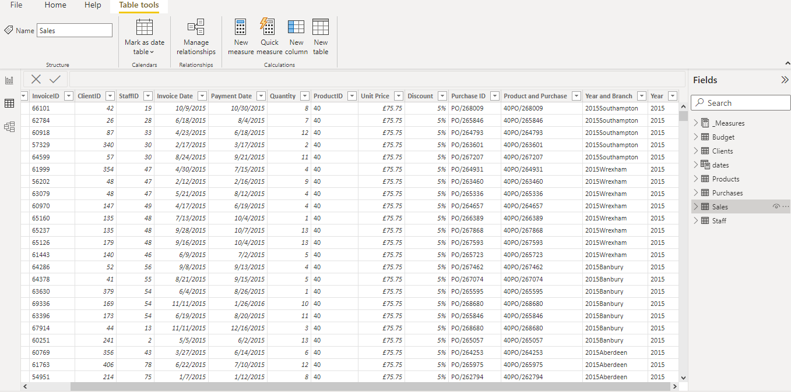
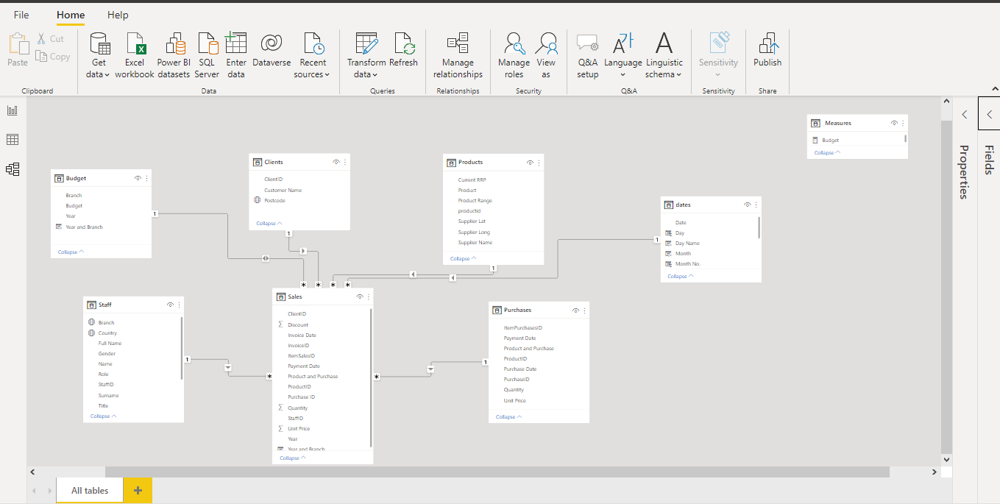
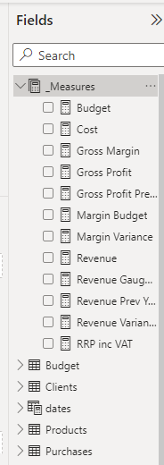
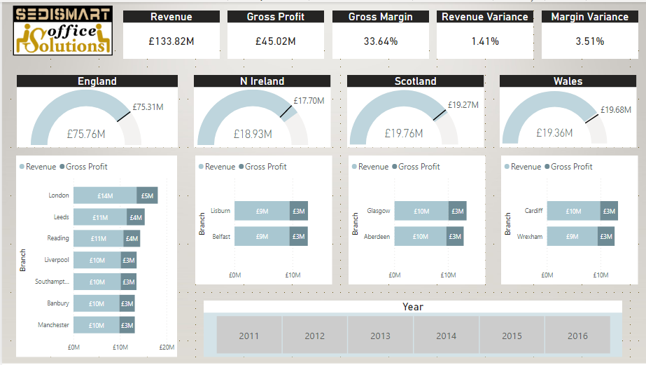
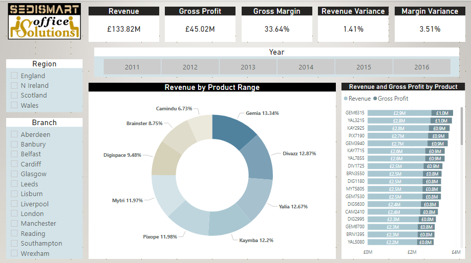
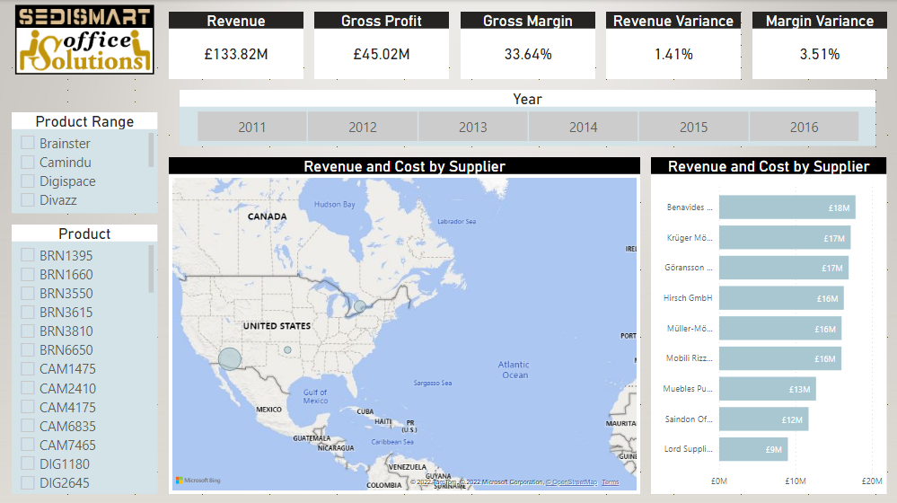
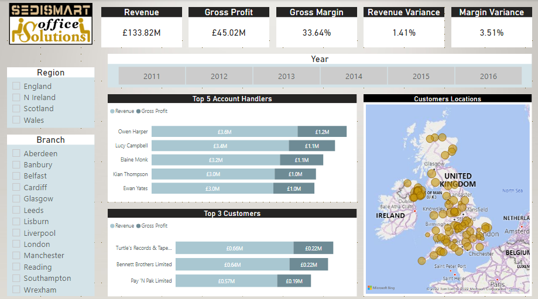
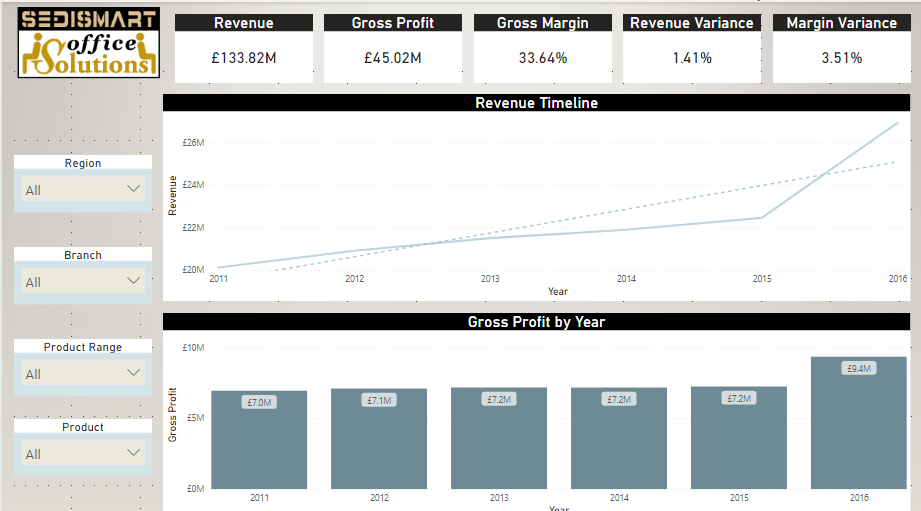

# DEDISMART Data Analytics

## Intro & Scenario:
SEDISMART is an imaginary office furniture &equipment company and the management has a meeting soon in which they discuss the business-status. The tasks were to provide a revenue analysis by multiple criteria using different business metrics. Furthermore, I received a 
business request to perform a revenue breakdown by different criterias and to show that in an interactive self-service dashboard. 

## Data Source:
Excel file containing the budget, staff, clients, sales, purchases and products tables. 

## Project Plan and Flow Summary

__Data Collection__
- Connected to the Excel files using Power Bi and extracted the relevant tables.\

__Data Preparation__
- Cleaned and munged the data extracted in  the query editor. 
- Added a composite keys to the sales and the purchases tables and to the sales and budget tables using DAX to be able to connect them in the data model.
- Constructed a dynamic calendar table from the first and last date in the sales table using DAX.\

__Data Modeling__
- Connected the tables in the data model.\

__Data Analysis__
- Calculated the business metrics using DAX.

__Data Visualization & Findings Presentations__

Designed a report with a 5 self-service interactive dashboards; revenue by regions and cities, revenue by products, revenue by suppliers, revenue by account handlers and customers, revenue timeline and trend.

The regions and cities dashboard included:
- Measures of revenue, gross profit, gross margin, revenue variance and margin variance in summary cards.
- Measure of revenue and budget for each region in a gauge chart.
- Measure of revenue and gross profit for each city in stacked bar chart.

The products dashboard included:
- Measures of revenue, gross profit, gross margin, revenue variance and margin variance in summary cards.
- Measure of revenue by product-ranges in a donut chart.
- Measure of revenue and gross profit by products in a stacked bar chart.
- Slicers of region, branch and year.

The suppliers dashboard included:
- Measures of revenue, gross profit, gross margin, revenue variance and margin variance in summary cards.
- Measures of revenue and cost by suppliers' locations in a map visual.
- Measures of revenue and cost by a supplier name in a bar chart.
- Slicers of product ranges, product and year.

The account handlers and customers dashboard included:
- Measures of revenue, gross profit, gross margin, revenue variance and margin variance in summary cards.
- Measure of revenue and gross profit by account handlers in a stacked dashboard.
- Measure of revenue and gross profit by customers in a stacked dashboard.
- Map visual to locate the top 30 customers for each account handler (some of the postcodes did not show in the map because it is a synthesized data).
- Slicers of region, branch and year.

The timeline and trends dashboard included:
- Measures of revenue, gross profit, gross margin, revenue variance and margin variance in summary cards.
- Timeline of the revenue by year with a drill down feature to the quarter and month levels.
- Measure of gross profit in a bar chart for each year.
- Slicers of region, branch, product-range and product.
